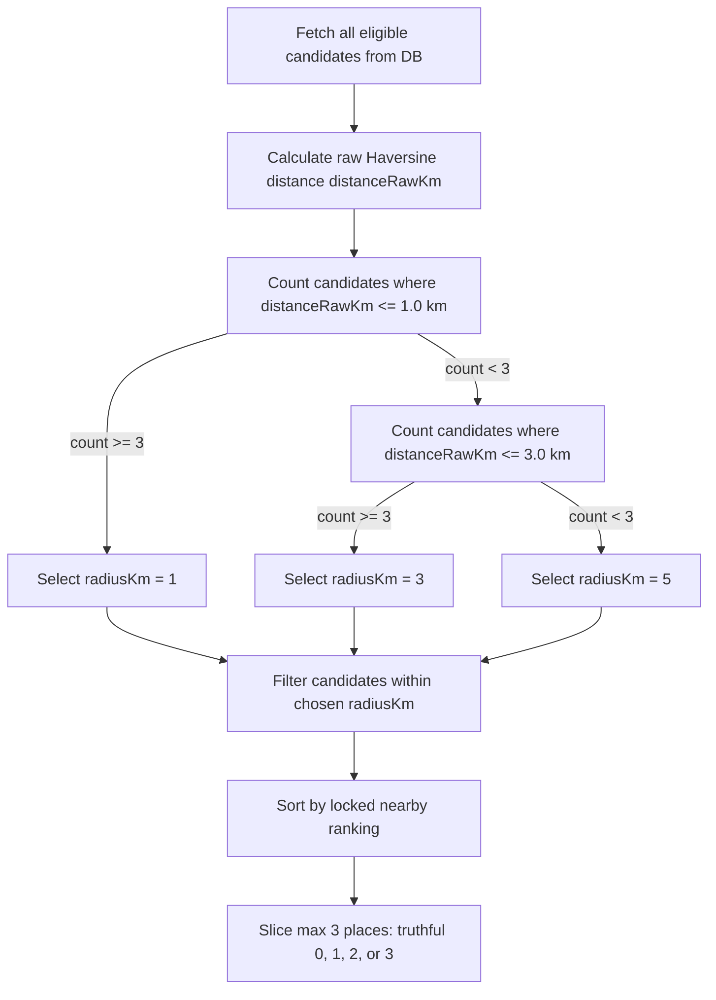
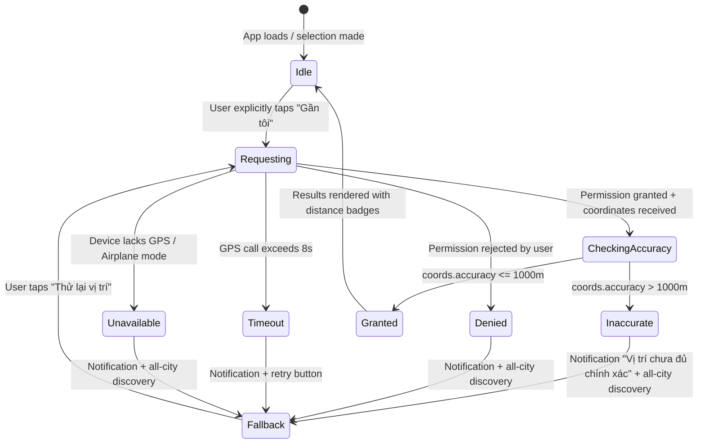

# M5-A / M5-A.1: GPS / Nearby Readiness Technical Audit & Contract Lock

> **Status:** AUDIT & CONTRACT LOCK — VERIFIED & LOCKED
> **Date:** 2026-10-07 (Audit) / 2026-10-08 (M5-A.1 Contract Lock)
> **Checkpoint:** `phase-2a-deploy` @ `8819cad5acfc105dbee0beb078fd2ad5149c878c`
> **Scope:** Audit existing geo codebase, database coordinates, discovery API contracts, radius expansion policies, ranking algorithms, UX state machine, privacy safeguards, and Cloudflare Edge runtime compatibility. Lock contract decisions 1–7 prior to M5-B implementation.
> **Constraints:** Zero changes to application source (`src/`), zero test changes (`tests/`), zero DB mutations (READ-ONLY queries only), no deployment, no Git push.

---

## 1. Executive Summary & Audit Status

Milestone **M5-A / M5-A.1** evaluates and locks the architectural and data contract for introducing geolocation-aware nearby discovery into *La Cà Đà Nẵng* without breaking existing guarantees (mobile-first, text-first, 0–3 truthful results, no fake fallback, no venue images, OpenNext Cloudflare Edge target).

| Component | Status | Findings / Locked Contract |
| :--- | :--- | :--- |
| **Geo Math Helpers** | READY | Pure TS Haversine implementation in `src/lib/geo/`; zero external packages. |
| **Geo Test Suite** | PASS | 18/18 isolated unit tests passing in `tests/geo.test.ts`. |
| **Database Coordinates** | READY | 500/500 places have valid, non-null, unique coordinates in Neon PostgreSQL. |
| **Current Discovery API** | AUDITED | Accepts `intent`, `locale`, `preference`; does NOT accept `lat`, `lng`, or `radius`. |
| **Candidate Retrieval (DB)** | CONTRACT LOCKED | M5-B must bypass pre-geo `LIMIT 3` in repository for Nearby mode to evaluate all eligible candidates. |
| **Distance Precision** | CONTRACT LOCKED | Full floating-point precision for radius comparison & sorting; 1 decimal only for final UI display. |
| **GPS Accuracy Threshold** | CONTRACT LOCKED | `coords.accuracy <= 1000m` uses Nearby; `> 1000m` warns and falls back to all-city discovery. |
| **Radius Expansion Policy** | CONTRACT LOCKED | Strictly `evaluate <= 1km (>=3 ? R=1) -> evaluate <= 3km (>=3 ? R=3) -> evaluate <= 5km (R=5)`; max 3 places, no padding. |
| **Nearby Ranking** | CONTRACT LOCKED | Locked to `distanceRawKm ASC, featured DESC, review_count DESC NULLS LAST, rating DESC NULLS LAST, id ASC`. |
| **Empty Nearby State** | CONTRACT LOCKED | Truthful 0–2 results; 0 results shows `"Không tìm thấy địa điểm phù hợp trong 5 km."` + CTA `"Xem trên toàn Đà Nẵng"`. |
| **Privacy Safeguards** | CONTRACT LOCKED | No app logging, no analytics, no DB/storage persistence, no coordinate echo in API response. |
| **Cloudflare Edge Runtime** | READY | Pure TS math works natively on Edge/V8 without Node.js bindings or native dependencies. |

---

## 2. Existing Geo Codebase Audit

### 2.1 File & Function Inventory

All geo logic is located in `src/lib/geo/`:

#### A. `src/lib/geo/distance.ts`
- **`Coordinates` Interface:**
  ```typescript
  export interface Coordinates {
    readonly latitude: number;
    readonly longitude: number;
  }
  ```
- **`isValidCoordinates(value: Coordinates): boolean`:**
  - *Input:* Object with `latitude` and `longitude`.
  - *Validation:* Checks `Number.isFinite(latitude) && Math.abs(latitude) <= 90` and `Number.isFinite(longitude) && Math.abs(longitude) <= 180`.
  - *Output:* `boolean`.
- **`calculateDistanceKm(from: Coordinates, to: Coordinates): number | null`:**
  - *Input:* Two `Coordinates` objects.
  - *Validation:* Rejects invalid coordinates, returning `null`.
  - *Formula:* Haversine great-circle distance.
  - *Earth Radius:* **6,371.0088 km** (IUGG mean Earth radius).
  - *Antipodal Clamping:* Clamps `a` via `Math.min(1, Math.max(0, a))` to avoid floating-point drift leading to `NaN` near antipodes.
  - *Precision:* Returns raw floating-point distance (`number`). Must **NOT** be prematurely rounded before filtering or sorting.
  - *Output:* Distance in kilometers (`number`) or `null`.

#### B. `src/lib/geo/filter-nearby.ts`
- **`DistanceMatch<T>` Interface:**
  ```typescript
  export interface DistanceMatch<T> {
    readonly item: T;
    readonly distanceKm: number;
  }
  ```
- **`filterPlacesWithinRadius<T>(places, origin, radiusKm, coordinatesOf): NearbyResult<T>`:**
  - *Input:* Array of items `T[]`, `origin: Coordinates`, `radiusKm: number`, `coordinatesOf: (item: T) => Coordinates | null | undefined`.
  - *Validation:*
    - Origin validation: If invalid, returns `{ status: "invalid_origin", matches: [], invalidPlaceCount: 0 }`.
    - Radius validation: If `radiusKm < 0` or non-finite, returns `{ status: "invalid_radius", matches: [], invalidPlaceCount: 0 }`.
  - *Boundary Rule:* Inclusive boundary (`distanceKm <= radiusKm`).
  - *Invalid Places:* Increments `invalidPlaceCount` and omits item if place coordinates are null or invalid. Does not coerce to `(0, 0)`.
  - *Output:* `NearbyResult<T>` with matched items and calculated distances. Does **not** truncate to top 3 or pad results.
- **`sortPlacesByDistance<T>(matches: readonly DistanceMatch<T>[]): DistanceMatch<T>[]`:**
  - *Input:* Array of `DistanceMatch<T>`.
  - *Logic:* Filters non-negative finite distances, copies array (non-mutating), sorts ascending by `distanceKm`, preserves original order on exact distance ties (`a.index - b.index`).
  - *Output:* Sorted `DistanceMatch<T>[]`.

### 2.2 Current Runtime Usage
- **0 runtime references:** Neither `src/app/api/discovery/route.ts` nor frontend components import or execute these helpers.
- They are completely isolated, pure utilities verified only by unit tests.

### 2.3 Current Geo Test Suite Audit
- File: `tests/geo.test.ts`
- Suite Execution: `npx vitest run tests/geo.test.ts` -> **18 passed (18)**.
- Verified test coverage:
  - Identical coordinates = 0 km; equatorial distance ~111.195 km per degree.
  - Antimeridian crossing on short arc.
  - Poles and antipodes handling without `NaN`.
  - Latitude boundary rejection (>90, <-90, NaN, Infinity).
  - Longitude boundary rejection (>180, <-180, NaN, Infinity).
  - Exact radius boundary inclusion.
  - Handling of missing/invalid coordinates in candidate list.
  - Zero radius only matching coincident points.
  - Negative/NaN/Infinity radius error status.
  - Stable sorting and preservation of input immutability.
  - Non-truncation of large arrays (1,000 points retained).

---

## 3. Database Coordinate Readiness Audit

A read-only SQL audit of the live Neon PostgreSQL database was conducted on 2026-10-07:

```sql
SELECT
    count(*) as total_places,
    count(latitude) as lat_count,
    count(longitude) as lng_count,
    count(*) FILTER (WHERE latitude IS NULL OR longitude IS NULL) as null_coords,
    count(*) FILTER (WHERE latitude IS NOT NULL AND longitude IS NOT NULL
                     AND latitude BETWEEN -90 AND 90 AND longitude BETWEEN -180 AND 180) as valid_global,
    count(*) FILTER (WHERE latitude IS NOT NULL AND longitude IS NOT NULL
                     AND (latitude < -90 OR latitude > 90 OR longitude < -180 OR longitude > 180)) as invalid_coords
FROM places;
```

### 3.1 Audit Findings

| Metric | Result | Target / Standard |
| :--- | :--- | :--- |
| **TOTAL PLACES** | **500** | 500 rows |
| **VALID COORDINATES** | **500** | 500 rows (100%) |
| **NULL COORDINATES** | **0** | 0 rows (0%) |
| **INVALID COORDINATES** | **0** | 0 rows (0%) |
| **COORDINATE DUPLICATES** | **0** | 0 shared pairs (100% unique) |
| **OPERATIONAL ACTIVE PLACES** | **500** | 500 operational |
| **LATITUDE BOUNDS** | `[15.0039655, 16.1728409]` | Đà Nẵng & verified administrative coverage |
| **LONGITUDE BOUNDS** | `[107.280669, 108.6998493]` | Đà Nẵng & verified administrative coverage |

### 3.2 Schema Definition & Database Constraints
- Columns:
  - `latitude`: `double precision NOT NULL`
  - `longitude`: `double precision NOT NULL`
- Table Constraints:
  - `ck_place_latitude`: `CHECK (latitude >= -90 AND latitude <= 90)`
  - `ck_place_longitude`: `CHECK (longitude >= -180 AND longitude <= 180)`
  - `places_latitude_not_null`: `NOT NULL`
  - `places_longitude_not_null`: `NOT NULL`
- **Assessment:** Database coordinates are in pristine condition. No cleanup, imputation, or schema migration is needed.

---

## 4. Current Discovery API & Candidate Retrieval Audit

### 4.1 Current Discovery API Surface

| Question | Current State | Evidence |
| :--- | :--- | :--- |
| **lat / lng query params supported?** | **NO** | `parseDiscoveryQuery` in `discovery-contract.ts` only parses `["intent", "locale", "preference"]`. |
| **radius query param supported?** | **NO** | No parameter for radius exists. |
| **Repository returns coordinates?** | **YES** | `DISCOVERY_SQL` in `place-repository.ts` selects `p.latitude, p.longitude`. |
| **Adapter exposes coordinates?** | **YES** | `adaptRow` in `place-adapter.ts` returns `location: { lat, lng }` on `DiscoveryPlace`. |
| **Frontend passes coordinates?** | **NO** | `DiscoveryResults.tsx` calls `/api/discovery?intent=...&locale=vi&preference=...`. |

### 4.2 Candidate Retrieval Audit (Pre-geo LIMIT 3 Problem)

In [src/lib/data/place-repository.ts](file:///d:/D%E1%BB%B1%20%C3%A1n%20t%C3%ACm%20%C4%91%E1%BB%8Ba%20%C4%91i%E1%BB%83m%20%C4%83n%20ch%C6%A1i/LaCaDaNang/danang_revised_pack/src/lib/data/place-repository.ts), the SQL CTE query `DISCOVERY_SQL` currently specifies:
```sql
WITH ranked AS (
  SELECT p.id, ...
  FROM places p
  WHERE ...
  ORDER BY p.featured DESC, p.review_count DESC NULLS LAST, p.rating DESC NULLS LAST, p.id ASC
  LIMIT $4
)
```
Where `$4` is clamped to `DISCOVERY_MAX_RESULTS` (= 3).

> [!CRITICAL]
> **Candidate Retrieval Contract for M5-B:**
> Nearby mode **must NEVER retrieve Top 3 under the city-wide ranking before calculating distances.** Doing so would only compute distances against the top 3 city-wide places, completely missing venues close to the user (e.g. 50m away) that happen to be ranked 4th or lower city-wide.
>
> **Locked Flow for Nearby:**
> 1. DB -> Query **all eligible candidates** matching the active `section` and `preference`/tags (bypassing pre-geo `LIMIT 3`).
> 2. Server -> Compute raw Haversine distance (`distanceRawKm`) for each candidate.
> 3. Server -> Execute radius escalation (`<= 1km` -> `<= 3km` -> `<= 5km`).
> 4. Server -> Filter candidate set to the chosen radius (`distanceRawKm <= radiusKm`).
> 5. Server -> Rank candidates using the locked nearby ranking rule.
> 6. Server -> Slice at most 3 places (`places.slice(0, 3)`).
>
> **For Non-Location Requests:**
> Keep existing discovery intact (`ORDER BY ... LIMIT 3` city-wide ranking).

---

## 5. Locked Location API Contract (M5-A.1 Lock)

### 5.1 Query Parameters
Coordinates remain **optional** query parameters to maintain full backward compatibility:

```http
GET /api/discovery?intent=EAT&locale=vi&preference=an_ngon&lat=16.0680&lng=108.2210
```

| Parameter | Type | Required? | Validation Rules | Error Behavior |
| :--- | :--- | :--- | :--- | :--- |
| `intent` | string | Required | Must be `EAT`, `GO`, or `STAY` | 400 `INVALID_PARAMETER` / `INTENT_NOT_AVAILABLE` |
| `locale` | string | Optional | `vi`, `en`, `ko` (default `vi`) | 400 `INVALID_PARAMETER` |
| `preference` | string | Optional | Valid preference ID | 400 `INVALID_PARAMETER` |
| `lat` | string | **Optional** | Float, `-90.0 <= lat <= 90.0` | 400 `INVALID_PARAMETER` (field: `"lat"`) |
| `lng` | string | **Optional** | Float, `-180.0 <= lng <= 180.0` | 400 `INVALID_PARAMETER` (field: `"lng"`) |

*Validation Rules:*
1. **Coupled validation:** If `lat` is provided, `lng` must also be provided, and vice versa. If only one is provided, return HTTP 400 `INVALID_PARAMETER`.
2. **Precision:** Browser `navigator.geolocation` provides ~6–8 decimal places. The server parses floats directly without premature rounding.
3. **No Coercion:** Empty strings or non-numeric values must return HTTP 400.

### 5.2 Distance Precision Contract
- **Calculation Precision:** Haversine distance must maintain **full floating-point precision** (`distanceRawKm`) for:
  - Radius boundary comparison: `distanceRawKm <= 1.0`, `<= 3.0`, `<= 5.0`.
  - Sorting: `distanceRawKm ASC`.
  - Deterministic tie-breaking.
- **Strict Rule:** **NO ROUNDING before radius filtering or sorting.** (e.g. Raw `1.04 km` must NEVER be rounded to `1.0 km` to slip into the 1 km radius).
- **Presentation Formatting:** Only after the final 0–3 places are selected, `distanceKm` is formatted to **1 decimal place** (e.g. `1.0`, `0.8`) for API response / UI display.

### 5.3 Response Schema Additions
When `lat` and `lng` are supplied and valid:
1. Each place in `places` receives an optional `distanceKm: number` property (formatted to 1 decimal place, e.g. `0.8`).
2. The `meta` object includes:
   ```json
   "meta": {
     "limit": 3,
     "ranking": "nearby-provisional-v1",
     "source": "neon-postgres",
     "radiusKm": 1
   }
   ```
> [!IMPORTANT]
> **API Response Does NOT Echo Coordinates:**
> To protect user privacy, the API response does **NOT** echo user coordinates (i.e. NO `meta.origin`).
> When `lat`/`lng` are omitted, `distanceKm` is `undefined`, and `meta.radiusKm` is `null`.

---

## 6. Radius Expansion Policy (Locked Decision 1)

### 6.1 Authoritative Expansion Rule
Product requirement specifies trying 1 km first, expanding to 3 km if insufficient, then 5 km if still insufficient, capped at 3 places with **zero fake padding**.

```
evaluate <= 1 km
if count >= 3:
    choose radius = 1
else:
    evaluate <= 3 km
    if count >= 3:
        choose radius = 3
    else:
        evaluate <= 5 km
        choose radius = 5

return at most 3 actual places
```

> [!CAUTION]
> **Crucial Clarification on "Insufficient" (< 3):**
> If 1 km yields 1 place, 3 km yields 2 places, and 5 km yields 2 places:
> - At 1 km: count = 1 (< 3) -> must evaluate 3 km.
> - At 3 km: count = 2 (< 3) -> **MUST NOT STOP AT 3 KM!** Must evaluate 5 km.
> - At 5 km: count = 2 (< 3) -> final `radiusKm = 5`, returning exactly **2 truthful places**.
> Expansion only stops early if candidate count is **>= 3**.



### 6.2 Deduplication & Determinism
- **Single Source Set:** The candidate set at 3 km is a strict superset of 1 km; 5 km is a strict superset of 3 km.
- **Deduplication:** Places are keyed by stable integer `id`. Expanding to a larger radius does **not** append duplicate cards; it simply expands the candidate pool from which the top 3 are selected.
- **Reporting Used Radius:** The API returns `meta.radiusKm: 1 | 3 | 5` indicating the evaluated radius.
- **Hard 5 km Cap:** If 5 km yields 0, 1, or 2 places, return exactly 0, 1, or 2 places with `meta.radiusKm: 5`. Never expand beyond 5 km automatically. Never inject unrelated places.

---

## 7. Nearby Ranking Contract (Locked Decision 6)

### 7.1 Separation of Concerns
1. **FILTER by Radius:** Strictly eliminates all venues with `distanceRawKm > selected_radius`. Venues outside 5.0 km are 100% ineligible.
2. **RANK within Radius:** Determines the order of candidates inside the valid radius.

### 7.2 Locked Ranking Formula
```text
distanceRawKm ASC, featured DESC, review_count DESC NULLS LAST, rating DESC NULLS LAST, id ASC
```
- **Hard Filter:** Venues with `distanceRawKm > radiusKm` are strictly excluded.
- **Proximity-First:** When a user explicitly chooses Nearby, raw distance is the primary sort criterion.
- **Quality Tie-Breaking:** Ties in distance are broken deterministically by `featured`, `review_count`, `rating`, and `id`.
- **No Complex Weights:** No arbitrary score weighting, machine learning models, or invented scoring algorithms.

---

## 8. Browser Geolocation UX, Accuracy & Empty State

### 8.1 State Machine Specification



### 8.2 Browser Accuracy Contract (Locked Decision 4)
When reading position from `navigator.geolocation.getCurrentPosition`:
- Inspect `position.coords.accuracy` (in meters):
  - **`accuracy <= 1000m`:** Position is considered sufficiently accurate. Proceed with Nearby query (`lat`, `lng`).
  - **`accuracy > 1000m`:**
    - **DO NOT** send location to Nearby query.
    - Display clear message: *"Vị trí chưa đủ chính xác để tìm địa điểm gần bạn. Đang hiển thị gợi ý toàn thành phố."*
    - Fallback to standard all-city discovery.
    - Provide a "Thử lại" (Retry) action.
- **Never fake location:** Do not substitute a mock Da Nang center coordinate.
- **Never persist:** Do not store accuracy or location in `localStorage` or cookies.

### 8.3 Permission Timing (Strict Rule)
- **NEVER prompt on initial page load:** Violates mobile-first and privacy best practices; causes user bounce and permission fatigue.
- **Foreground Action Only:** Permission is requested **only** when the user performs a deliberate action (e.g. toggles "Gần tôi" button).

### 8.4 Empty Nearby State Contract (Locked Decision 7)
- If 5 km yields 1–2 results: Display exactly 1–2 results. **Zero padding.**
- If 5 km yields 0 results:
  - Message: `"Không tìm thấy địa điểm phù hợp trong 5 km."`
  - CTA Button: `"Xem trên toàn Đà Nẵng"`
  - CTA Action: Re-triggers discovery without `lat`/`lng`, preserving the active `intent` and `preference`.

---

## 9. Privacy & Security Contract (Locked Decision 5)

1. **Query Parameters Over HTTP:** M5-B continues using optional `lat` and `lng` in GET query parameters to minimize scope changes.
2. **Infrastructure Logging Reality:** Documentation acknowledges that query parameters transmitted via HTTP may appear in standard infrastructure/access logs (web proxies, Cloudflare edge logs).
3. **Application Contract:**
   - Application code does **NOT** log raw `lat`/`lng`.
   - Analytics events do **NOT** receive raw `lat`/`lng`.
   - **NO Database persistence:** Coordinates are never stored in the database.
   - **NO Client persistence:** Coordinates are never stored in `localStorage`, `sessionStorage`, or cookies.
   - **NO URL leakage:** Navigation or shareable URLs do not contain GPS coordinates.
   - **NO Response Echo:** API responses do **NOT** echo user coordinates.
4. **Future Evaluation:** If stronger privacy guarantees are required in future phases, a POST request body contract can be reviewed separately.

---

## 10. Cloudflare Workers / Edge Compatibility

- **Next.js 15 Edge Route:** `src/app/api/discovery/route.ts` runs on `export const runtime = "edge"`.
- **Driver:** `@neondatabase/serverless` operates via HTTP `fetch` without TCP sockets.
- **Geo Calculation:** `calculateDistanceKm` is written in 100% pure TypeScript utilizing native `Math` functions (`sin`, `cos`, `atan2`, `sqrt`).
- **Dependencies:** **Zero external dependencies required.** No GIS packages, no heavy native libraries (like `proj4`, `turf`, or `geolib`).
- **Performance:** Calculating Haversine distance in-memory for 134 candidate rows takes **< 0.2 milliseconds**, completely avoiding DB spatial extension requirements (`PostGIS`) on Neon.

---

## 11. Regression Contract for M5-B

The implementation of M5-B must guarantee that the following baseline behaviors remain 100% intact:

1. **EAT, GO, STAY:** Continue fetching verified Neon database records.
2. **Preference Mapping:** All existing tag and general mappings (`an_ngon`, `dac_san`, `hen_ho`, `chup_anh_dep`, `thien_nhien`, `vui_choi`, `bien_ngam_canh`, `gan_bien`, `yen_tinh`, `gan_trung_tam`, `cap_doi`) remain active and accurate.
3. **Truthful 0–3 Output:** Results must strictly contain 0, 1, 2, or 3 places. **No fake padding under any condition.**
4. **Deduplication:** All returned places must have unique IDs.
5. **Maps Links:** All Google Maps URLs must be verified stored links.
6. **No-Image MVP:** Cards remain text-first; no image fetching or layout shifts.
7. **NOW Section:** Remains static sample itinerary ("Lịch trình mẫu").
8. **CAFE Section:** Remains disabled (returns HTTP 400 `INTENT_NOT_AVAILABLE`).
9. **Database Schema:** Zero DDL or data changes permitted during M5-B.

---

## 12. Test Plan for M5-B Implementation

### Unit Tests (`tests/geo.test.ts` & `tests/discovery-nearby.test.ts`)
- [ ] Exact Haversine coordinates vs known great-circle values.
- [ ] Floating-point boundary tests: raw `1.00001 km` excluded from 1 km radius.
- [ ] Origin coordinate validation (lat -91, 91, lng -181, 181, NaN, Infinity).
- [ ] Locked expansion logic:
  - 1 km yields >= 3 -> return 1 km Top 3 (`radiusKm = 1`).
  - 1 km yields 1–2, 3 km yields >= 3 -> return 3 km Top 3 (`radiusKm = 3`).
  - 1 km yields 1, 3 km yields 2, 5 km yields 2 -> return 2 places (`radiusKm = 5`).
  - 5 km yields 0 -> return 0 places (`radiusKm = 5`).
- [ ] Verification of zero duplicate IDs across radius expansion.
- [ ] Distance ascending ordering with rating/review tie-breaking.

### API Integration Tests
- [ ] `GET /api/discovery?intent=EAT&lat=16.068&lng=108.221` -> HTTP 200, places have `distanceKm`.
- [ ] API response meta does NOT contain user origin coordinates.
- [ ] `GET /api/discovery?intent=EAT&lat=invalid` -> HTTP 400 `INVALID_PARAMETER`.
- [ ] `GET /api/discovery?intent=EAT&lat=16.068` (missing `lng`) -> HTTP 400 `INVALID_PARAMETER`.
- [ ] `GET /api/discovery?intent=EAT` (omitted location) -> HTTP 200, regression test passing.

### Frontend Component Tests
- [ ] State transition: Idle -> Requesting -> CheckingAccuracy -> Granted/Inaccurate/Denied.
- [ ] `accuracy > 1000m` -> shows warning and renders standard discovery.
- [ ] Denied permission gracefully renders standard discovery results.
- [ ] Empty state at 5 km displays CTA "Xem trên toàn Đà Nẵng".

---

## 13. Evidence-Based Local Simulation Results (Updated with Locked Policy)

Using a read-only script querying the live 500-place Neon database with Haversine distance from 3 sample coordinates across Đà Nẵng:
- **Point A (Hải Châu - Trung tâm / Cầu Rồng):** `(16.0680, 108.2210)`
- **Point B (Mỹ Khê - Bãi biển / An Thượng):** `(16.0540, 108.2440)`
- **Point C (Liên Chiểu - Hòa Khánh ngoại ô):** `(16.0600, 108.1500)`

### Simulation Data Table (Evaluated with Locked Decision 1)

| Test Location | Scenario | Total in DB | <= 1 km | <= 3 km | <= 5 km | Locked Escalation Behavior |
| :--- | :--- | :---: | :---: | :---: | :---: | :--- |
| **Point A (Hải Châu)** | EAT - Tất cả (`an_ngon`) | 134 | **5** | 15 | 27 | Satisfied at 1 km -> returns Top 3 (`radiusKm = 1`) |
| | EAT - Đặc sản (`dac_san`) | 10 | 0 | 0 | **1** | Expands 1 -> 3 -> 5 km -> returns **1 truthful place** (`radiusKm = 5`) |
| | EAT - Hẹn hò (`hen_ho`) | 2 | 1 | 2 | **2** | Expands 1 -> 3 -> 5 km -> returns **2 truthful places** (`radiusKm = 5`) |
| | GO - Chụp ảnh đẹp (`chup_anh_dep`) | 16 | 0 | 2 | **2** | Expands 1 -> 3 -> 5 km -> returns **2 truthful places** (`radiusKm = 5`) |
| | GO - Biển ngắm cảnh (`bien_ngam_canh`) | 20 | 0 | 1 | **1** | Expands 1 -> 3 -> 5 km -> returns **1 truthful place** (`radiusKm = 5`) |
| | GO - Thiên nhiên (`thien_nhien`) | 26 | 0 | 0 | **0** | Expands 1 -> 3 -> 5 km -> returns **0 places** (`radiusKm = 5`) |
| | STAY - Gần biển (`gan_bien`) | 19 | 0 | **3** | 6 | Expands 1 -> 3 km -> returns Top 3 (`radiusKm = 3`) |
| | STAY - Trung tâm (`gan_trung_tam`) | 16 | **4** | 16 | 16 | Satisfied at 1 km -> returns Top 3 (`radiusKm = 1`) |
| | STAY - Yên tĩnh (`yen_tinh`) | 8 | 0 | 0 | **0** | Expands 1 -> 3 -> 5 km -> returns **0 places** (`radiusKm = 5`) |
| **Point B (Mỹ Khê)** | EAT - Tất cả (`an_ngon`) | 134 | **3** | 16 | 25 | Satisfied at 1 km -> returns Top 3 (`radiusKm = 1`) |
| | EAT - Hẹn hò (`hen_ho`) | 2 | 0 | 2 | **2** | Expands 1 -> 3 -> 5 km -> returns **2 truthful places** (`radiusKm = 5`) |
| | GO - Chụp ảnh đẹp (`chup_anh_dep`) | 16 | 0 | 2 | **2** | Expands 1 -> 3 -> 5 km -> returns **2 truthful places** (`radiusKm = 5`) |
| | GO - Biển ngắm cảnh (`bien_ngam_canh`) | 20 | 0 | 1 | **1** | Expands 1 -> 3 -> 5 km -> returns **1 truthful place** (`radiusKm = 5`) |
| | STAY - Gần biển (`gan_bien`) | 19 | 1 | **5** | 6 | Expands 1 -> 3 km -> returns Top 3 (`radiusKm = 3`) |
| | STAY - Trung tâm (`gan_trung_tam`) | 16 | 2 | **9** | 15 | Expands 1 -> 3 km -> returns Top 3 (`radiusKm = 3`) |
| **Point C (Liên Chiểu)** | EAT - Tất cả (`an_ngon`) | 134 | 2 | **6** | 9 | Expands 1 -> 3 km -> returns Top 3 (`radiusKm = 3`) |
| | EAT - Đặc sản (`dac_san`) | 10 | 0 | 0 | **1** | Expands 1 -> 3 -> 5 km -> returns **1 truthful place** (`radiusKm = 5`) |
| | STAY - Gần biển (`gan_bien`) | 19 | 0 | 0 | **1** | Expands 1 -> 3 -> 5 km -> returns **1 truthful place** (`radiusKm = 5`) |
| | GO - Thiên nhiên (`thien_nhien`) | 26 | 0 | 0 | 0 | Expands 1 -> 3 -> 5 km -> returns **0 places** (`radiusKm = 5`) |

---

## 14. Risks & Mitigations

1. **Zero-Result Experience:** When a user selects a niche preference (e.g. `thien_nhien` from city center), 0 results will exist within 5 km.
   *Mitigation:* Locked empty state displays `"Không tìm thấy địa điểm phù hợp trong 5 km."` with a 1-tap CTA `"Xem trên toàn Đà Nẵng"` to re-run discovery without coordinates.
2. **Inaccurate Browser GPS:** Device on Wi-Fi or cellular tower can report high uncertainty.
   *Mitigation:* Locked accuracy check (`accuracy <= 1000m`). Position with `accuracy > 1000m` is refused for Nearby and falls back to city-wide discovery with user explanation.
3. **Repository Pre-geo LIMIT 3 Pitfall:**
   *Mitigation:* Locked Candidate Retrieval Contract ensures repository retrieves all candidates for section/tag in Nearby mode before distance filtering.

---

## 15. Recommended M5-B Implementation Scope

1. **Repository & Contract Layer:**
   - Add capability in `PlaceRepository` to retrieve all candidate rows for an active section/tag filter when nearby location is provided (bypassing pre-geo `LIMIT 3`).
   - Parse optional `lat` and `lng` query parameters with strict coupled validation.
   - Run in-memory Haversine distance with full float precision and locked 1km -> 3km -> 5km escalation.
   - Rank candidates via locked nearby ranking and slice max 3.
   - Format `distanceKm` to 1 decimal place and return `meta.radiusKm` (do not echo user coordinates).
2. **UI Layer:**
   - Add One-thumb "Gần tôi" action button.
   - Implement Geolocation State Machine with accuracy guard (`<= 1000m`).
   - Render distance badges on `PlaceCard`.
   - Implement locked empty state with `"Xem trên toàn Đà Nẵng"` CTA.
3. **Automated Testing:**
   - Unit tests for float precision, boundary cases, escalation logic, and accuracy filtering.
   - Regression tests for EAT, GO, STAY non-location discovery.
